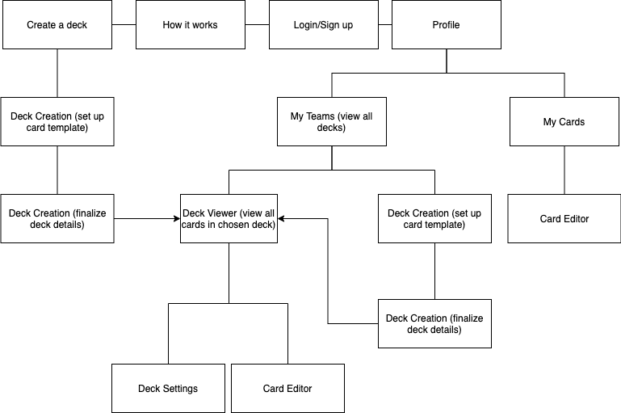

# UX Design

## Prototype
An interactive version of the Invision prototype can be found [here](https://projects.invisionapp.com/share/5J11VJM29DYF#/screens). 

## App Map

## Wireframes

### Deck Creation

The first screen (Create a new deck) is the default landing page where people can immediately create a new deck for their team. The second screen wraps up the deck creation flow.

 

### Deck Viewing

After 1) creating a deck or 2) clicking a link to an existing deck, users are taken to this screen where they can view existing cards and create new ones.

 

### Card Creation

These screens are shown when the user wants to create a new card. They are prompted to create an optional account that enables them to come back and edit their card.

 

### Updating a Deck / Card

These screens are shown when the user wants to edit a deck or deck that they created.

 

### Log in / Sign up

These screens enable the user to create a new account (and explain the benefits of doing so) and to log into an existing account.

 

### How it works

This page offers a brief explanation as to what Pokédek is and how it works.

### Profile page

This screens are only enabled for logged in users – on their profile page, they can easily view all teams they owned/joined and the respective cards they created for those decks.

 

### Hamburger Menu

The hamburger menu will slide out from the left on mobile and just be reflected as a navigation bar on the top of desktop view.

